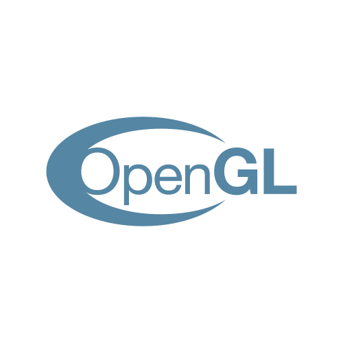
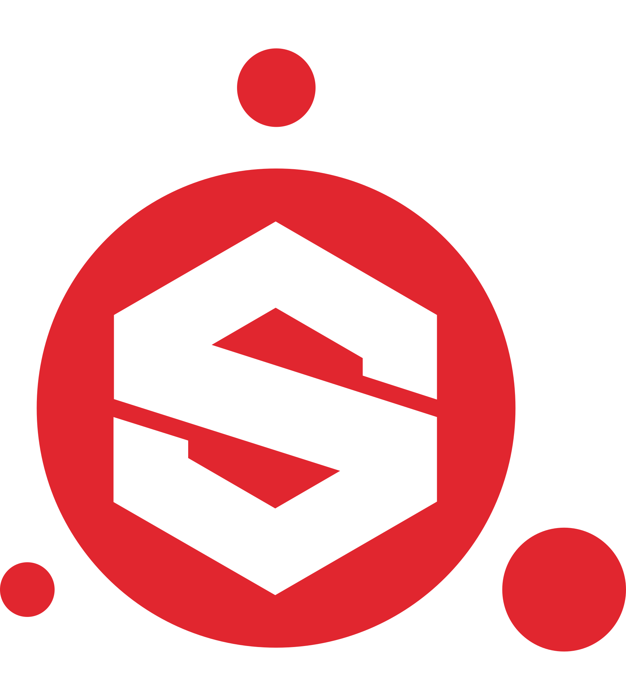
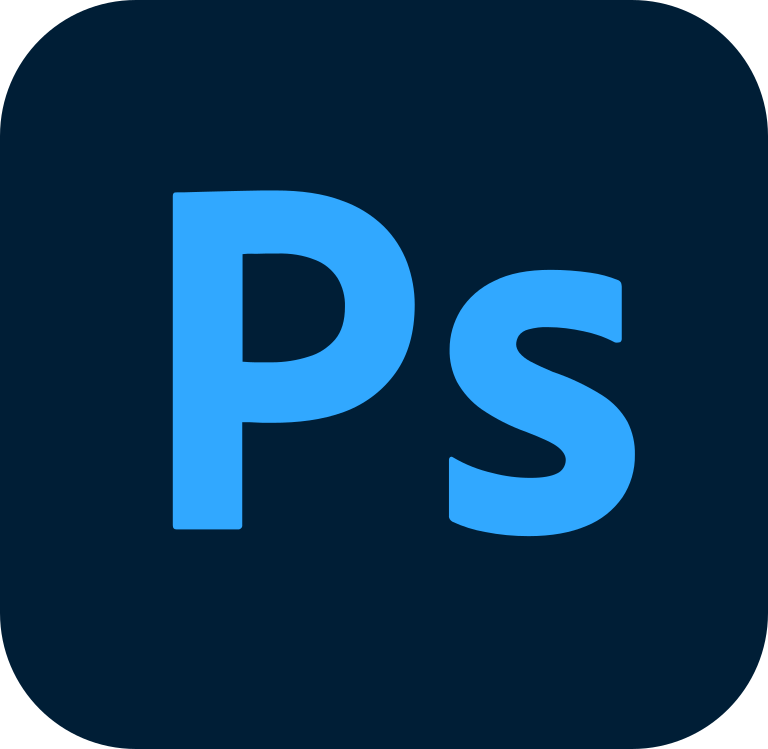
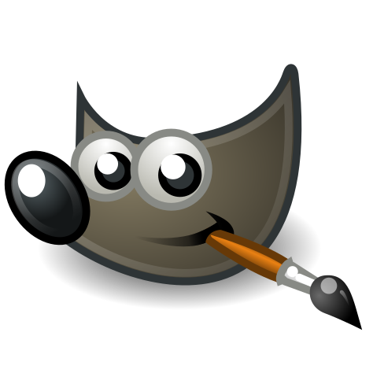

# Всем Привет! 👋


```csharp
public class Developer:
{
    GameObject Persona = new GameObject();
       
    public void MySelf(string me)
    {
        Persona.name = me;
        Persona.roles[] = {"Game_Developer", "DevOps", "Game_Designer"};
        Persona.language_spoken[] = {"ru_RU", "en_US"};
        Persona.tecs_tools[] = {"Docker", "Kubernetes", "Ansible", "PostgreSQL", "MySQL", "SQLite", "Prometheus+Grafana"};
        Persona.lang[] = {"C#", "Python", "GoLang", "Java+Spring", "C++", "HLSL"};
        Persona.web[] = {"HTML", "CSS", "PHP", "JavaScript", "Svelte", "LAMP"}
        Persona.gotExp[] = {"Linux", "Mikrotik", "Blender", "Photoshop/GIMP", "Inkscape", "Autocad", "Audition"};
        Persona.isGood = True;
        Persona.isGamer = True;        
    }   
    
    public void SayHello()
    {
        Debug.Log("Спасибо, что заглянули, надеюсь, вам будут интересны мои работы.");
    }
    
    public void Start()
    {
        MySelf(Andrey_T);
        SayHello();
    }
}
```
<hr>

## 🗂️ Мои репозитории
###  Kubernetes 
* [POD creation sample](https://github.com/Taran-Tool/Kubernetes_POD_Sample "POD creation sample")
### GDD 
* [GDD Sample](https://github.com/Taran-Tool/GDD "GDD Sample")
### Shaders
* ["HLSL Basic Light Model](https://github.com/Taran-Tool/HLSL-Basic-Light-Model "HLSL Basic Light Model")
### Games
* [Octree Sample](https://github.com/Taran-Tool/Octree "Octree Sample")
* [TBS Field Game](https://github.com/Taran-Tool/TBS-field "TBS Field Game")


<hr>

## 🔥 Был замечен в использовании следующих штук: 🔥
<br>

<p align="center">
  <code></code>
  <code></code>
  <code></code>
  <code></code>
  <code></code>
  <code></code>
  <code></code>
  <code></code>
  <code></code>
  <code></code>
  <code></code>
  <code></code>
  <code></code>
  <code></code>
  <code></code>
  <code></code>
  <code></code>
  <code></code>
  <code></code>
  <code></code>
  <code></code>
  <code></code>
  <code></code>
  <code></code>
  <code></code>
  <code></code>
  <code></code>
  <code></code> 
  <code></code> 
  <code></code>
  <code></code> 
</p>

<hr>
